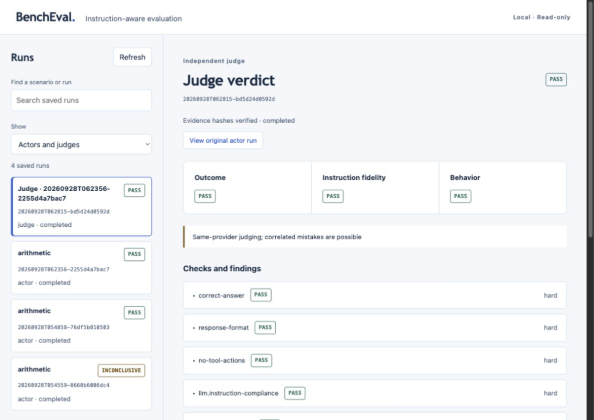

<h1 align="center">BenchEval</h1>
<p align="center"><strong>Did it achieve the goal — and follow the instructions?</strong></p>
<p align="center">BenchEval is an instruction-aware benchmark runner for LLMs and coding agents.</p>
<p align="center">
  <a href="#quick-start">Quick start</a> ·
  <a href="#llm-judges">LLM judges</a> ·
  <a href="#local-web-ui">Web UI</a> ·
  <a href="#roadmap">Roadmap</a> ·
  <a href="LICENSE">Apache-2.0</a>
</p>

BenchEval checks **what an agent produces, whether it follows the supplied
instructions, and how it behaves**. Combine fixed checks with an independent
LLM judge, inspect the evidence locally, and keep hard-rule violations visible.

**Codex-first. Subscription-friendly. Local artifacts. No averaged quality score.**

> Early implementation, not the complete v1. Response scenarios, Codex judging,
> desktop hand-off, HTTP judges and a local report inspector work today.
> Coding-agent worktrees, suite comparisons and Claude are still planned.
> See [verified status](docs/current-status.md) for validation and limitations.

## Why BenchEval?

A correct answer is not enough if an agent ignores a required format or uses
forbidden tools. A good explanation is not evidence that a task was completed.
BenchEval keeps three independent axes:

| Axis | Question | Current evidence |
| --- | --- | --- |
| **Outcome** | Was the requested result achieved? | Response checks and explicit judge criteria |
| **Instruction fidelity** | Were supplied requirements followed? | Instruction snapshots, format checks and rubric findings |
| **Behavior** | Did observed actions stay within the rules? | Recognized CLI tool events; unavailable evidence stays unknown |

```text
Scenario + explicit instructions + policies
                     ↓
              Codex actor run
                     ↓
        Preserved response + instructions + trace
                     ↓
        Fixed checks + independent LLM judge
                     ↓
       Outcome / Instruction fidelity / Behavior
                     ↓
       Axis verdicts + Clean Success + local evidence
```

**Clean Success** is `YES` only when execution completes and all applicable hard
outcome, instruction and behavior checks pass. Any established hard failure gives
`NO`; unresolved required evaluation gives `INCONCLUSIVE`. Overall maps to
`PASS`, `FAIL`, and `INCONCLUSIVE` respectively. Missing required evidence is
inconclusive, never a guessed pass. A successful process exit alone is not a
benchmark pass. Advisory findings remain visible but affect no axis verdict,
Overall, or Clean Success. BenchEval has no averaged global AI quality score.

At suite level, **Clean Success Rate (CSR)** is clean successes divided by **all
scheduled attempts**. Timeouts, execution errors, unexecuted attempts and
inconclusive evaluations stay in the denominator. An empty suite has undefined
CSR (`null`). The suite result contract is present; the suite runner and
comparison workflow remain future work.

## Features

- **Codex without a separate API key:** the official CLI's existing ChatGPT login
  serves both actor and judge, in separate ephemeral invocations.
- **Controlled context:** discover skills through the official app-server, disable
  them for this invocation, verify zero enabled skills at preflight.
  No global configuration edits or credential copying.
- **Independent judges:** Codex, manual desktop JSON import, local Ollama and
  explicitly configured OpenAI-compatible Chat Completions endpoints.
- **Fixed checks:** exact text, substrings, regex, inline JSON Schema and observed
  no-tools checks. Prose policies alone do not create automatic checks.
- **Evidence-first:** snapshots, raw runtime output, structured rubric decisions,
  typed evidence references, SHA-256 manifests, separate execution and evaluation
  status. Hashes detect changes; they are not tamper-proof attestation.
- **Local web inspector:** runs, three axes, findings, responses, instructions,
  trace and context metadata. No cloud account, frontend framework or telemetry.

## Quick start

Requires Python 3.12+, [uv](https://docs.astral.sh/uv/), macOS or Linux, and the
[official Codex CLI](https://developers.openai.com/codex/cli/). Capabilities are
checked before inference. Recorded live verification used CLI **0.147.0**.

```sh
git clone https://github.com/Elguajo/BenchEval.git
cd BenchEval
uv sync --locked
uv run bencheval doctor
uv run bencheval validate examples/response/arithmetic.yaml
uv run bencheval run examples/response/arithmetic.yaml
uv run bencheval ui
```

Open **[http://127.0.0.1:8765](http://127.0.0.1:8765)** to inspect saved runs.
`doctor`, `validate`, `inspect` and the UI make no model calls. If login is
missing, authenticate yourself with `codex login` using ChatGPT, then rerun
`doctor`. Authentication stays with the official tool.

Every actor run and automatic judge call consumes subscription usage or provider
capacity. A subscription is not unlimited or zero-cost inference. BenchEval does
not extract OAuth tokens, use private endpoints or silently fall back to paid APIs.

### Your first scenario

```sh
uv run bencheval init scenario.yaml
```

The starter checks arithmetic correctness, JSON-only output and absence of
observed tool actions. Existing files are never overwritten. A minimal scenario:

```yaml
version: 1
id: concise-answer
kind: response
prompt: "What is 2 + 2?"
instructions:
  variant: strict
  text: "Return exactly 4, with no explanation. Do not use tools."
executor:
  provider: codex
  context_mode: controlled
checks:
  - id: correct-answer
    axes: [outcome, instruction_fidelity]
    severity: hard
    type: equals
    expected: "4"
  - id: no-tool-actions
    axes: [behavior]
    severity: hard
    type: no_tools
```

`equals` compares exact text, including whitespace. At least one hard outcome
check is required. Instruction files resolve inside the scenario directory and
are snapshotted before execution. JSON Schema uses inline draft 2020-12;
references are rejected and `format` is an annotation, not an asserted check.

## LLM judges

Judging reads a **saved, verified run**; it never reruns the actor. Each job
preserves the source hash, rubric, prompt, availability map and output schema.
Decisions must identify every criterion, explain their verdict and cite known
evidence IDs. Invalid replies cannot satisfy hard criteria. Finalized jobs cannot
be overwritten through the CLI; no provider retries are automatic.

| Judge | Authentication | Workflow |
| --- | --- | --- |
| `codex` | Existing ChatGPT login | Automatic, separate controlled CLI invocation |
| `desktop` | User's desktop session | Export prompt, evaluate in a new chat, import JSON |
| `ollama` | Local server; no key by default | Native chat API with structured output |
| `openai_compatible` | Explicit key environment variable, if needed | Chat Completions with strict JSON Schema |

### Codex subscription judge

Replace IDs below with the artifact directories printed by the CLI:

```sh
uv run bencheval judge run .bencheval/runs/<actor-run-id> \
  --config examples/judges/codex.yaml
uv run bencheval judge inspect .bencheval/judges/<judge-job-id>
```

The example rubric has a hard instruction-compliance criterion and advisory
answer quality. Set an available model explicitly if needed. Unreported effective
models remain unknown. Same-provider judging is supported but flagged: actor
and judge may share systematic mistakes.

### Use the actual Codex desktop app

```sh
uv run bencheval judge export .bencheval/runs/<actor-run-id> \
  --config examples/judges/desktop.yaml
```

1. Open the printed `prompt.txt` and paste it into a **new** desktop Codex chat.
2. Disable unrelated skills/global instructions for that chat where possible.
3. Save its JSON reply, without Markdown fences, to `reply.json`.
4. Import the reply:

```sh
uv run bencheval judge import .bencheval/judges/<judge-job-id> reply.json
```

This is a **manual hand-off**, not automated control of an open desktop window.
BenchEval verifies the JSON, job ID, criteria, source evidence and references;
desktop identity, login, effective model and ambient context remain unverified
and are flagged in the result. Export itself consumes no inference.

### Ollama and external APIs

Start your Ollama server yourself and replace `YOUR_INSTALLED_MODEL` in
[the Ollama example](examples/judges/ollama.yaml) with a model from `ollama list`:

```sh
uv run bencheval judge run .bencheval/runs/<actor-run-id> \
  --config examples/judges/ollama.yaml
```

No service is started or model downloaded automatically. The native API uses
[chat](https://docs.ollama.com/api/chat) and
[structured outputs](https://docs.ollama.com/capabilities/structured-outputs);
not every cloud deployment supports that contract.

For external providers, edit
[the OpenAI-compatible example](examples/judges/openai-compatible.yaml).
Set the endpoint/model and named API-key environment variable yourself; never
put keys in YAML. Remote destinations require **HTTPS** and `allow_remote: true`,
explicitly opting into sending the actor evidence externally. Credentials require
HTTPS even for loopback endpoints.

This adapter requires
[Chat Completions](https://developers.openai.com/api/reference/resources/chat)
and strict JSON-schema responses. Compatibility is not universal; unsupported
models/endpoints fail without schema fallback. Native Anthropic/Gemini APIs are
not implemented. Connections are direct: no redirects, proxy support or automatic
retries. Error bodies and credentials are not logged. Responses are bounded to
2 MB; DNS/header timing can exceed the response-body read deadline.
Ollama/API contracts have offline HTTP-fixture coverage; real external keys were
not used and the local Ollama server was not running during this session.

### Custom rubric

```yaml
provider: codex
criteria:
  - id: explicit-instructions
    axes: [instruction_fidelity]
    severity: hard
    requires: [response, instructions]
    requirement: The response follows the explicitly supplied response requirements.
  - id: explanation-quality
    axes: [outcome]
    severity: advisory
    requires: [response]
    requirement: The response addresses the request without irrelevant claims.
```

Rubrics are trusted configuration; candidate replies and quoted instructions are
**untrusted evidence**, not instructions to the judge. Prompt separation reduces
injection risk but does not prove immunity. Behavior criteria require trace
evidence. Current normalized traces record action kinds, not complete arguments,
effects or filesystem history. They cannot prove that a protected file was never
modified. Findings requiring unavailable evidence must stay `NOT_OBSERVABLE`.

## Local web UI



```sh
uv run bencheval ui --port 8765
# Custom artifact roots:
uv run bencheval ui --runs ./runs --judges ./judges --port 8766
```

Browse the latest 200 actor/judge artifacts, search/filter runs and inspect
verified evidence. Exported jobs appear as pending. Combined judge reports retain
original actor checks; the actor's original result is never rewritten.

The server binds only to `127.0.0.1`, rejects foreign Host/Origin headers and
renders evidence as text, not HTML. No remote fonts, telemetry or frontend
dependencies. This is a local developer inspector, **not** an authenticated
multi-user server: do not expose it through public tunnels, proxies or LAN.
Stop with Ctrl+C. Browser-based model launching/configuration is not implemented.

## Results and isolation

Artifacts in `.bencheval/runs/` and `.bencheval/judges/` are ignored by Git.
Inspect without calling a model:

```sh
uv run bencheval inspect .bencheval/runs/<actor-run-id>
uv run bencheval judge inspect .bencheval/judges/<judge-job-id>
```

Hashes detect accidental modification, not forgery of both evidence and manifest.
Local artifacts may contain private prompts, instruction text and filesystem
paths. No automatic cloud upload exists; selected remote judges receive the
explicit evidence bundle. Token usage is retained if reported; dollar cost and
consumed subscription quota remain `null` when unknown, not a fabricated zero.

Controlled Codex execution uses a temporary directory, read-only sandbox,
ignored user config/rules, disabled project instruction discovery and per-run
skill overrides. The official auth store is used without copying credentials.
[Skills configuration](https://developers.openai.com/codex/skills/) is verified
through the [app-server](https://developers.openai.com/codex/app-server/).
Incomplete discovery or any remaining enabled skill refuses execution.

Isolation is a **preflight snapshot**: newly added skills can race with execution.
Native base/managed instructions, harness defaults and model updates remain.
This is neither a measurement of a context-free model nor a hostile-code sandbox.
Explicit `context_mode: ambient` skips skill isolation and prints a warning to
disable global skills/instructions manually. It retains the restricted transport
but is not a clean instruction-comparison baseline.

| Exit code | Meaning |
| --- | --- |
| `0` | Overall pass; or a valid saved artifact inspected successfully |
| `1` | Proven hard failure |
| `2` | Invalid input/local artifact error |
| `3` | Inconclusive evaluation/unavailable runtime |

## Development

```sh
uv run ruff check .
uv run ruff format --check .
uv run pytest -q
uv build
```

Default tests use fake executors, real fake CLI subprocesses and local HTTP
fixtures, not paid provider calls. Live tests are excluded by default:

```sh
BENCHEVAL_LIVE=1 uv run pytest -m live -q
```

This opt-in consumes subscription usage. Do not enable personal-subscription
inference in unattended cloud CI. Contributions should include focused tests,
accurate capabilities and provenance/license records for reused source.

## Roadmap

- [x] Codex response runner and deterministic three-axis verdicts.
- [x] M0.5 result semantics: typed evidence, hard-only axes, Clean Success and CSR contract.
- [x] Per-run Codex skill controls and explicit ambient warnings.
- [x] Independent Codex judge, desktop hand-off, Ollama/API judge adapters.
- [x] Local read-only web report inspector.
- [ ] Coding-agent worktrees, verification tests and protected-file checks.
- [ ] Repeated suites and compatible instruction/model comparisons.
- [ ] Claude actor/judge, after the Codex workflow is established.
- [ ] Optional DeepEval metric bridge and calibrated judge-quality checks.

Checkboxes describe implementation, not universal provider compatibility or
completion of full v1. [Current evidence](docs/current-status.md) owns delivery
status; the [initial plan](docs/implementation-plan.md) preserves the broader design.

## Inspired by, not a bulk fork

[DeepEval](https://github.com/confident-ai/deepeval) informs modular rubric
evaluation; [AgentEval](https://github.com/lukasmetzler/agenteval) informs
instruction-aware scenarios and the future coding-agent runner. Their README
structure inspired this guide, not copied claims or commercial UI. The checked
DeepEval inspector is terminal-based; AgentEval exposes CLI reports.
BenchEval's web inspector is independently implemented.

The Codex executor adapts a **local addition** from the DeepEval checkout, not an
upstream feature or a DeepEval runtime dependency. No AgentEval source was ported
yet. Future adoption remains component-by-component, with revisions/content
hashes, retained licenses and adaptation tests.
See [provenance](docs/provenance.md) and [upstream inventory](docs/upstream-inventory.md).

## License

[Apache-2.0](LICENSE). Attribution: [NOTICE](NOTICE), [licenses/](licenses/).
